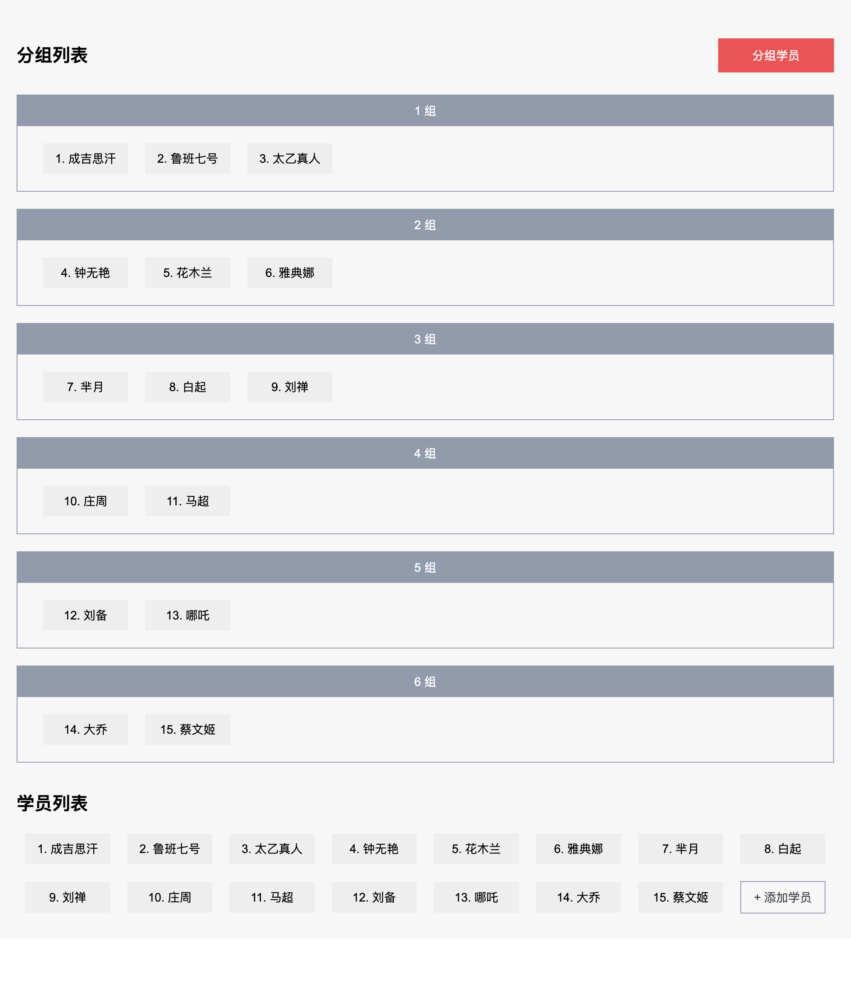

# Setup

## Start Server

Server started at `http://localhost:1234` . Parcel is used for bundler.

```
npm run start
```

## Run Jest Test

Jest is used for Unit Test.

```
npm run test
```

## Color Palettes

Color is defined at `src/style/_variables.scss` .

| Color         | Value   |
| ------------- | ------- |
| Bg color      | #f7f7f7 |
| Light gray    | #eeeeee |
| Gray          | #929aab |
| Dark Gray     | #393e46 |
| Primary color | #ea5455 |

## Mock up


